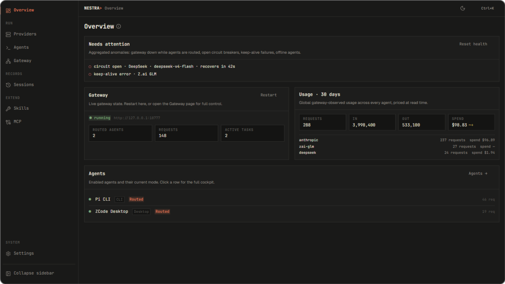

# Nestra

 

I've got a few coding plans and was tired of switching between them by hand. So I built **Nestra**. It's a local gateway that routes every request to the right provider, plus one interface to manage them all. Plain provider config without routing works too. Ability to config sub-agents with their own per-role policies.

<p align="center">
  
</p>

## Install

Grab the setup from [GitHub Releases](https://github.com/Nuo27/Nestra/releases/latest).
well, windows yet

## Get started

1. Launch — installed agents are detected automatically.
2. Providers → add one: pick a preset, paste a key, and pick the model.
3. On the agent's page, bind the provider and flip to **Routed**. Run your
   agent; every request lands in Gateway → Activity with its route, model,
   and tokens.

## Routing

Each agent runs **Direct** (Nestra writes the real provider into its config)
or **Routed** (a stable gateway alias on `127.0.0.1:18777`).

In Routed mode
every request resolves through a fixed cascade — explicit pin → task
affinity → role policy → fail closed — and role policies carry ordered
`(endpoint, model)` chains per `(agent, role)`, so a quota death or a
failing model walks to the next target instead of killing the task.

## What else

- Quota keep-alive for z.ai / MiniMax windows
- Live request logs with task deep links
- Session history with context-pressure estimates and handoff artifacts
- Per-agent skills and MCP sync

## Build from source

```bash
pnpm install && pnpm tauri dev   # develop
pnpm tauri build                 # release installer
```

Requires Node 18+, Rust, pnpm, and the
[Tauri 2 prerequisites](https://v2.tauri.app/start/prerequisites/).

## Privacy

Local-only. Keys are encrypted at rest (AES-256-GCM), telemetry doesn't
exist, and the gateway binds to `127.0.0.1` only.

## License

[MIT](LICENSE)
