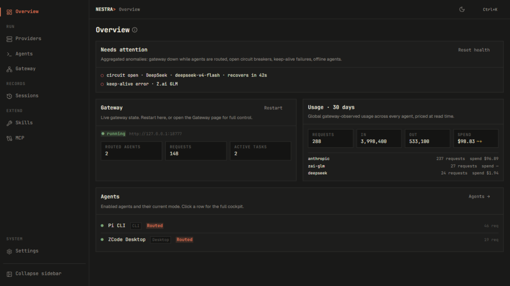
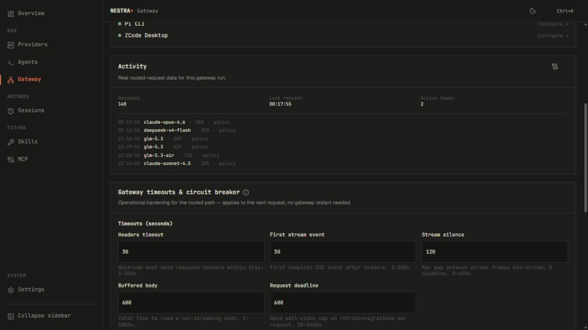
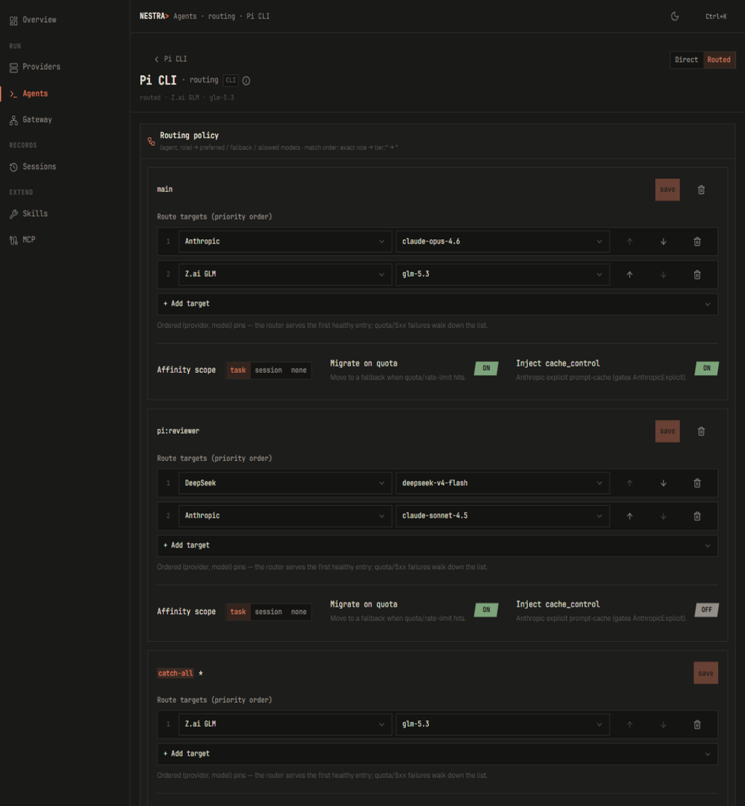
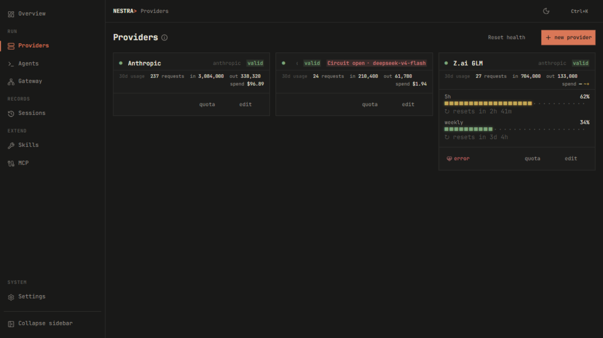
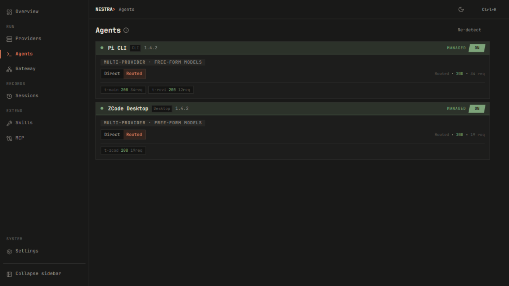
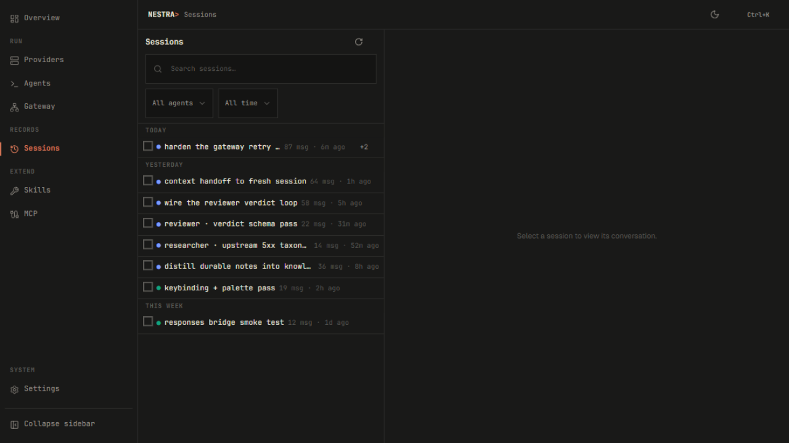

# Nestra


> A local-only desktop control center for AI coding agents.

- **Route everything** — a local gateway with per-role routing chains, quota-aware failover, and a model-grain circuit breaker.
- **Own your keys** — encrypted at rest (AES-256-GCM), no account, no telemetry, traffic never leaves `127.0.0.1`.
- **See everything** — sessions, quotas, live request logs, and per-model usage in one place.

## Screenshots

<table>
  <tr>
    <td></td>
    <td></td>
  </tr>
  <tr>
    <td></td>
    <td></td>
  </tr>
  <tr>
    <td></td>
    <td></td>
  </tr>
</table>

## Supported agents

One registry line per agent — every surface (config, sessions, MCP, routing) derives from it.

- **Claude Code** — `claude` CLI; tier-aware routing (`[haiku]` / `[sonnet]` / `[opus]`).
- **OpenCode** — desktop app; per-server MCP enable state.
- **Pi** — `pi` CLI; per-role sub-agents and the review runtime.
- **ZCode** — desktop app.
- **Codex** — desktop app; Responses-API inbound bridging.

Agents are auto-detected on launch, and every config write is backed up first.

## Install

Download from [GitHub Releases](https://github.com/Nuo27/Nestra/releases/latest):

- **NSIS** (`.exe` setup) — recommended for most users.
- **MSI** — for enterprise / managed environments.

Windows today; macOS and Linux are on the roadmap.

## Quickstart

1. **Launch** — Nestra detects installed agents automatically.
2. **Add a provider** — Providers → new: pick a preset, paste a key. Keys are validated on save.
3. **Bind & flip Routed** — on the agent's page, bind the provider and switch to
   **Routed**. Run your agent; requests land in Gateway → Activity with per-request
   route, model, and token usage.

## Routing

Each agent runs in one of two modes (toggled on its page):

| Mode    | What Nestra writes     | What you get                                       |
| ------- | ---------------------- | -------------------------------------------------- |
| Direct  | the real provider      | Nestra as configurator only                        |
| Routed  | a stable gateway alias | routing, failover, usage observation — per request |

In Routed mode the gateway resolves every request through a fixed cascade:
**explicit** pin → **affinity** (keep a task on one provider so the prompt
cache amortizes) → **role policy** → fail closed rather than guess.

Role policies are keyed by agent *and* role — the main thread plus detected
sub-agent roles (`claude:researcher`, `pi:reviewer`, `opencode:agent`, …).
Each `(agent, role)` pair carries an ordered `(endpoint, model)` chain: the
first healthy entry serves; failures walk the list. A `*` catch-all covers
roles without their own row, and Claude Code's tier hints (`[haiku]`,
`[sonnet]`, `[opus]`) resolve through `tier:*` roles.

Resilience is honest: quota exhaustion migrates a task mid-stream to the next
target (same `task_id`, marked `generation_broken` — a retry is never claimed
as lossless continuation); a model-grain circuit breaker keeps healthy models
available when one model on an endpoint fails; agent disconnects finalize as
499 instead of dangling. Every request is observable in the live log viewer
(`/gateway/logs`), correlated by task id.

## Beyond routing

- **Quota** — 5-hour-window keep-alive for z.ai / MiniMax, reactive 429 detection, per-endpoint bars.
- **Sessions & handoff** — history imported from each agent, context-pressure estimates, one-click handoff artifacts that seed a fresh session.
- **Skills & MCP** — per-agent skill install/enable; MCP servers (stdio or HTTP) synced into agent configs.
- **Review runtime** — an isolated Pi reviewer routed via the `pi:reviewer` role, streaming live to a structured verdict.

## Building from source

```bash
pnpm install     # frontend dependencies
pnpm tauri dev   # run in development mode
pnpm tauri build # release installer

pnpm typecheck && pnpm test   # frontend checks
cd src-tauri && cargo test    # Rust suite
```

Requires [Node.js](https://nodejs.org/) 18+, [Rust](https://rustup.rs/),
[pnpm](https://pnpm.io/), and the
[Tauri 2 prerequisites](https://v2.tauri.app/start/prerequisites/).

## Privacy

Nestra is local-only: no cloud, no account, no telemetry. API keys are
encrypted at rest and never leave your machine; the gateway binds to
`127.0.0.1` only.

## License

[MIT](LICENSE)
